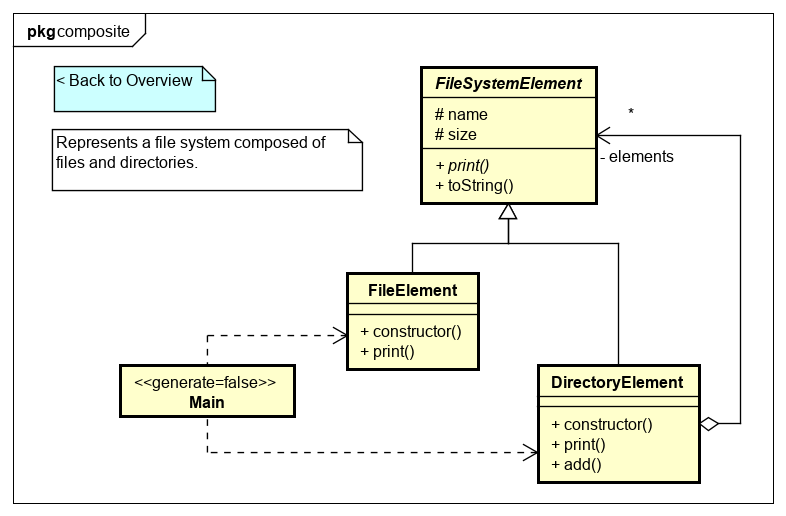
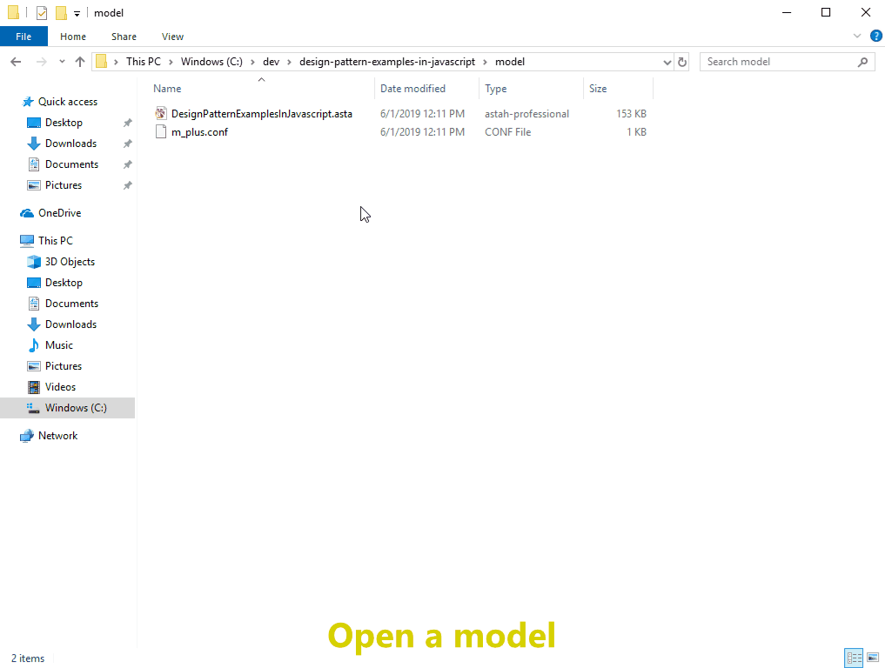

[](https://raw.githubusercontent.com/takaakit/design-pattern-examples-in-javascript/master/screenshots/DiagramMap.svg)

Design Pattern Examples in JavaScript
===

Model and code examples of design patterns for JavaScript.  
You can utilize this examples as follows.

* You try Model-Driven Development (MDD) using Astah and M PLUS plug-in.
* You understand the mapping between UML model and JavaScript code.
* You understand the design pattern examples in JavaScript.  
  etc.

> UML model example:



> JavaScript code example:

```javascript:FileElement class
// ˅
'use strict';

import { FileSystemElement } from './file-system-element.mjs';

// ˄

export class FileElement extends FileSystemElement {
    // ˅
    
    // ˄

    constructor(name, size) {
        // ˅
        super();
        this.name = name;
        this.size = size;
        // ˄
    }

    // Print this element with the "upperPath".
    print(upperPath) {
        // ˅
        console.log(upperPath + '/' + this.toString());
        // ˄
    }

    // ˅
    
    // ˄
}

// ˅

// ˄
```

Installation
------------
**Astah**
* Download Astah UML or Professional from [Change Vision site](http://astah.net/download), and install.  

**M PLUS plug-in**
* Download the plug-in from [M PLUS plug-in site](https://sites.google.com/view/m-plus-plugin/download), and install.  
  **Use ver.2.5.0 or higher.**

**Development Environment for JavaScript**
* Install [Visual Studio Code](https://code.visualstudio.com/download).
* Install [Node.js](https://nodejs.org/en/) ver.12.17.0 or higher.

Usage
-----
* Select model elements on the model browser of Astah, and press the "Generate code" button to generate.  
* The generated code has "User Code Area". The "User Code Area" is the area enclosed by "˅" and "˄". Handwritten code written in the "User Code Area" remains after a re-generation.
* You can run the program from "main.mjs" or HTML file for each design pattern.
* For detailed usage of the tools, please see [Astah Manual](http://astah.net/manual) and [M PLUS plug-in Tips](https://sites.google.com/view/m-plus-plugin/tips).



References
----------
* Gamma, E. et al. Design Patterns: Elements of Reusable Object-Oriented Software, Addison-Wesley, 1994
* Hiroshi Yuki. Learning Design Patterns in Java [In Japanese Language], Softbank publishing, 2004

Licence
-------
This project is licensed under the Creative Commons Zero (CC0) license. The model and code are completely free to be used.

[](http://creativecommons.org/publicdomain/zero/1.0/deed)
